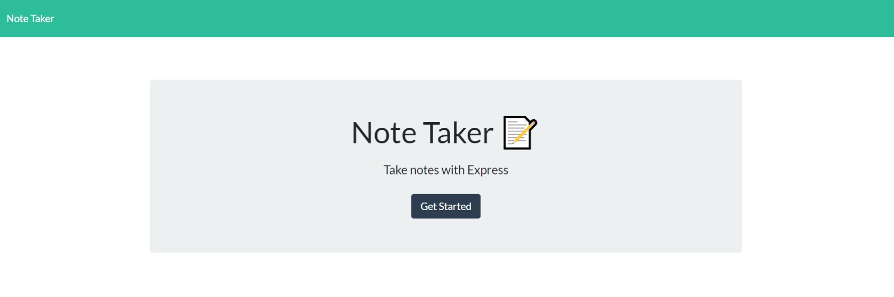

  
  
  # Note Taker
  
  
  ## Table of Contents
[Description](#Description)     
  
[Languages/Technologies](#Languages/Technologies)
  
[Installation Instructions](#Installation)
  
[Usage Instructions](#Usage)
  
[License](#License)
  
[Contribution](#Contribution)
  
[Testing](#Testing)
  
[Acknowledgements](#Acknowledgements)
  
[Questions](#Questions)
  

  ## Description 
  ---
  An application to create and review notes.
  
  ## Languages/Technologies
  ---
  Node.js, Express.js, JavaScript, HTML, CSS
  
  ## Installation Instructions
  ---
  None
  
  ## Usage Instructions
  ---
  In your browser, navagate to short-note-taker.herokuapp.com.  Click on the "get started button.  Saved notes are on the left side of the screen and can be viewed by clicking on them.  Clicking on the pencil icon at the top right will allow you to create a new note.  Once an entry is made in the Note Title AND the Note Text sections, a save icon will appear in the top right of the screen.  Clicking on the save icon will save the note to the left side of the screen, which can be viewed by clicking on it.
  
  ## License
  ---
  Licensed under the MIT license.
  
  ## Contribution
  ---
  https://github.com/durcoorigin/notetaker
  None
  
  ## Testing
  ---
  None
  
  ## Acknowledgements 
  ---
  None
  
  ## Questions
  ---
  [GitHub](https://github.com/durcoorigin) profile.

  E-mail: twitchshort@gmail.com
  
  ### Built by Chris Short 
  

